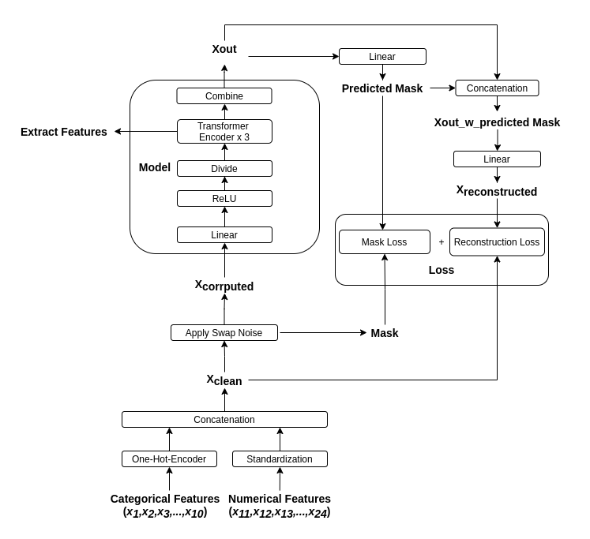
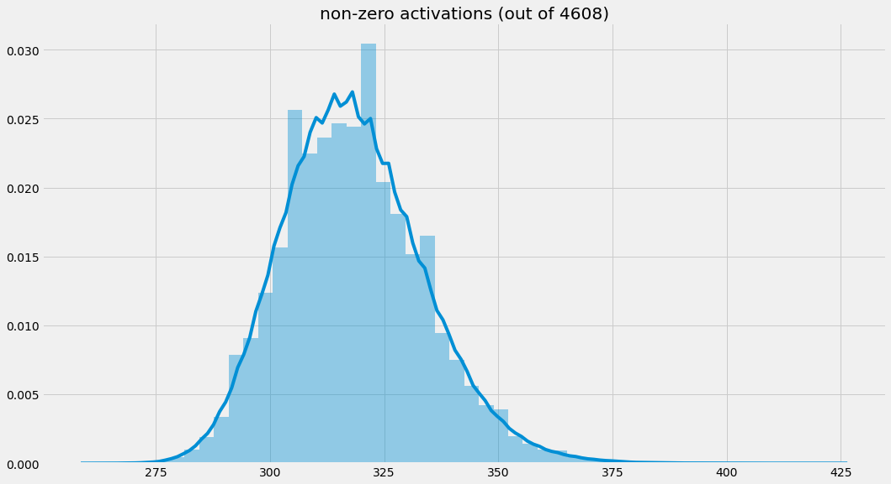
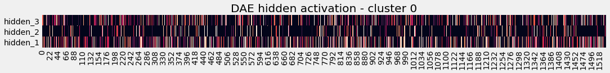
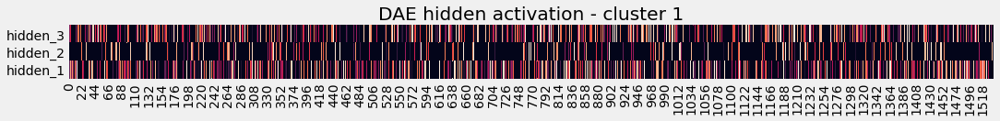
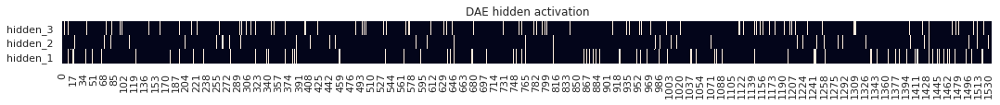
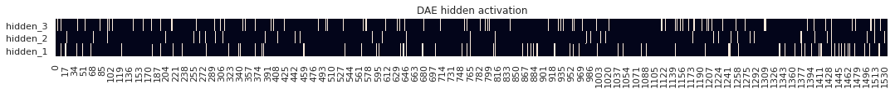

# Denoise Transformer AutoEncoder

This repo holds the denoise autoencoder part of my solution to the Kaggle competition [Tabular Playground Series - Feb 2021](https://www.kaggle.com/c/tabular-playground-series-feb-2021).  

Most of my effort was spent on training denoise autoencoder networks to capture the relationships among inputs and use the learned representation for downstream supervised models. 

## Reproducing a single model
1. Get the code and move to the code directory.
2. Install python packages as specified in [requiretments.txt](requiretments.txt). 
3. Download the competition data and modify the path in [data.py](data.py).  
4. Run `python train.py` and wait for about 20 hours on a single GPU machine. 

It should show a cross-validated RMSE score of around 0.8412 with ridge regression. 

## About the network  
1. The network is an AutoEncoder network with intermediate layers that are transformer-style encoder blocks.  
2. The network is trained to perform two tasks: 1) to predict the data corruption mask, 2) to reconstruct clean inputs.  
3. Features can be extracted from the transformer encoder outputs for downstream tasks.   

A diagram of the network is as follow:  

## Observations and thought process  
### Get an ok DAE.  
I first experimented with a good old Autoencoder with `(linear->relu) x 3` as intermediate layers, the learned representations can support a linear regressor with RMSE score in the 0.843x range. Close but not as good as GBDT. 

This is not an easy task, I spent two weeks tweaking things to get to this score. The key is to find reasonable noise ratios for each input. 

### Sparse activations  
Upon obtaining the learned representations, I noticed that they are very sparse. 

The network I looked at has 4608 hidden neurons. On average, only ~7% of the neurons are activated(non-zero) for an input sample. 
  

But looking at the activations on the whole dataset, only very few neurons(~3%) are truly dead(would never activate).  

My hypothesis is that the network developed dedicated connections for different clusters of input data.   

To verify this might be the case. I ran clustering algorithm to group data into 128 clusters(so each cluster has less than 1% total data, if somewhat balanced) and compared:  
  1) The activations between two clusters and 
  2) The activations between pairs of data points within the same cluster.    

#### Between clusters 

Here are example visualizations of the activations per cluster. 
  

  

Staring at these pictures does not tell me much, they look similar, but not without noticeable differences.  

I calculated the ratio of neurons that can be activated by data from both clusters to neurons that can be activated by data from either cluster. I guess we will call this activation IOU for now. The value is on average right about 2/3.

#### Within clusters 
However, this IOU ratio for two random data points from the same cluster is on average 95/100.   

That is: for every single input going through the network, there are a good amount of activations that are specific for about 1% of the total data that are 'similar' to it. 

I think this is good enough for me to be comfortable with my hypothesis. The network developed [expertized sub-networks](https://www.cs.toronto.edu/~hinton/csc321/notes/lec15.pdf), without been explicitly told to do so via a gating mechanism. 

### How noise change things
Next, I looked at the effect of applying swap noise, to see how it changes the activations.
  

 

I pass single input through my swap noisy generator and compare the aforementioned IOU ratio between corrupted input and clean input as well as between pairs of corrupted inputs. It dropped to around 4/5 on average. More importantly, checking the activations, they rarely are outside the known activations for the clusters.

I take this as: 
1. The added noise moved corrupted samples away from their cluster center a bit. But most likely still belong to the cluster, as indicated by the activations(not many unknown activations to the cluster). Thus they are not beyond rescue. This reinforces that it is crucial to add adequate noise.   
2. The network can notice the difference in where/how the input got corrupted, which may be interpreted as the difference in direction/distance which they got pulled away from the center, and thus activates neurons accordingly to pull them back. 

I think the network here developed(and it should) connections vaguely correspond to the different conditioning. By which, I mean connections that models `P(x_i | x_j, x_k,...x_z)` where `x_i` is the corrupted input. A different corruption will activate different such connections in the network. So the network is sort of like an ensemble of [MADE models](https://arxiv.org/pdf/1502.03509.pdf). 

## Enters transformer encoders
All the above is good. But realistically, there will never be crystal clear cut clusters, and there will never be 100% confidence about which conditioning is the best to use. 

Thus, each data point should be considered by multiple clusters, and multiple conditioning should be activated, and all those can be pooled and distilled in stages. 

With the above observations/intuition, I realized that transformer encoder should be a great fit for this task. 
1. I can divide the problem space into subspaces, each somewhat resembles a cluster. (At least I hope so)   
2. The multi-head self-attention mechanism will try multiple conditioning and then pool them together.  

So I coded it up and it worked great. 

## Final remark  
Note the dataset is synthetically generated by running [CTGAN](https://github.com/sdv-dev/CTGAN) on a real-world tabular dataset. Thus the feasibility to apply this approach to a real dataset needs to be explored. 